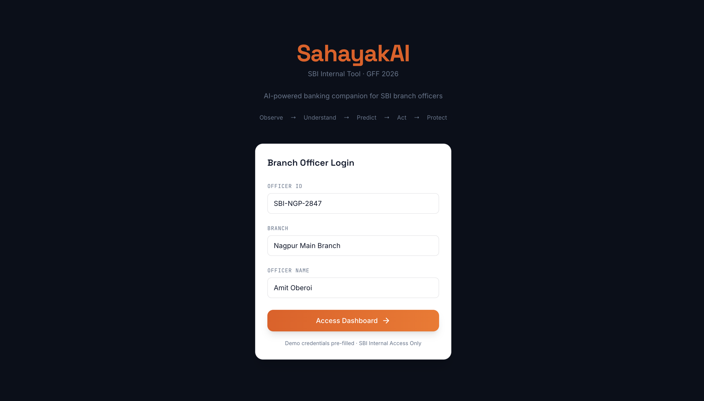
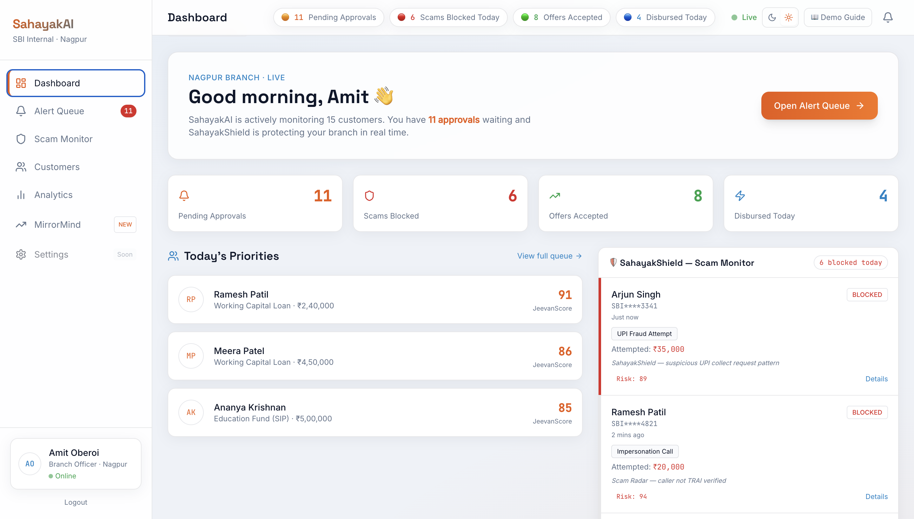
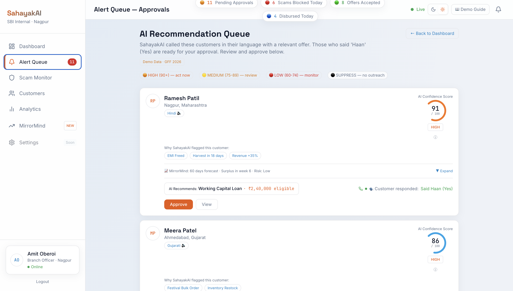
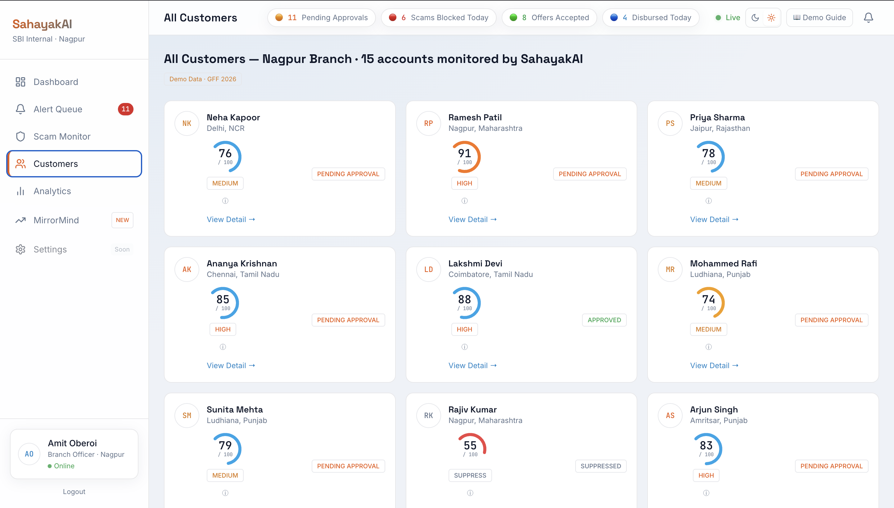
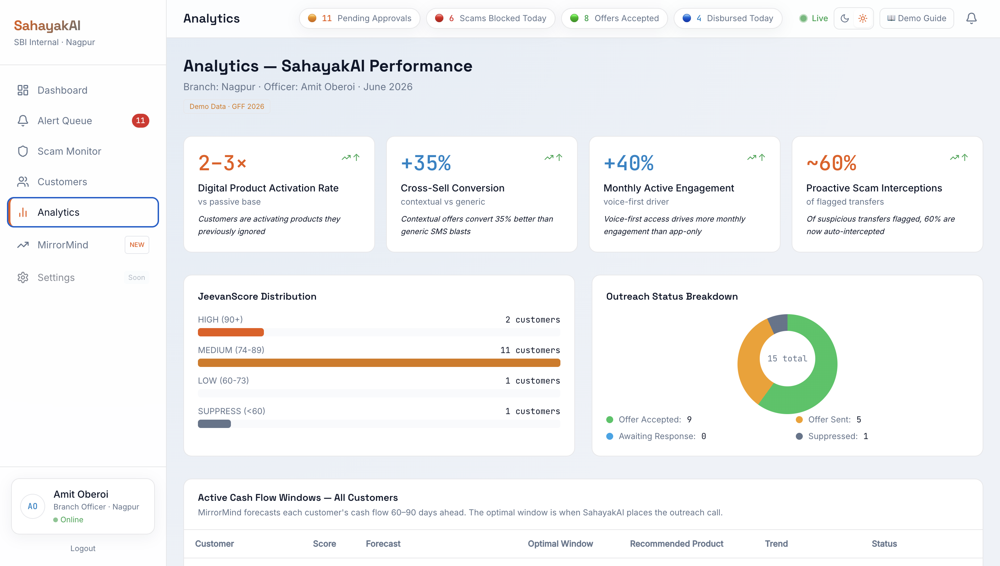
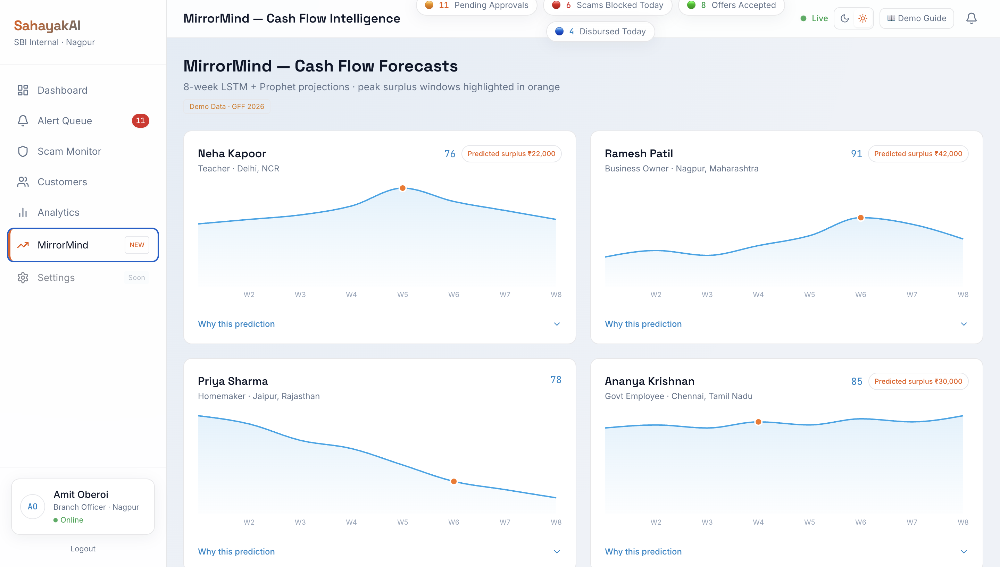

<div align="center">

# 🏦 SahayakAI

### AI-Powered Decision Intelligence Platform for SBI Branch Officers

[](https://react.dev)
[](https://vitejs.dev)
[](https://tailwindcss.com)
[](https://expressjs.com)
[](https://sbi-bice.vercel.app)

<br/>

**[🚀 Live Demo](https://sbi-bice.vercel.app/) · [📖 Docs](#-overview) · [⚙️ Setup](#-installation) · [🧠 AI Modules](#-ai-modules)**

<br/>

> *Stop reacting to customers. Start predicting them.*

</div>

---

## 📖 Overview

**SahayakAI** is an AI-powered decision support platform built specifically for **State Bank of India (SBI) Branch Officers**.

Traditional banking relies on reactive engagement — customers walk in, officers respond. SahayakAI flips this model entirely. It continuously monitors customer behaviour, predicts future financial needs, detects fraud in real time, and surfaces the right product offer at the right moment — before the customer even asks.

The result: branch officers spend less time analyzing spreadsheets and more time closing conversations that matter.

---

## 🎯 The Problem

Branch officers today are overwhelmed by noise and starved of signal.

| Pain Point                | Impact                           |
| ------------------------- | -------------------------------- |
| Manual customer analysis  | Hours wasted per day             |
| Missed cross-sell windows | Lost revenue opportunities       |
| Reactive fraud response   | Financial loss already occurred  |
| No lead prioritization    | Low-value conversations dominate |
| No cash-flow foresight    | Poor product-timing decisions    |

SahayakAI solves all five with a unified AI dashboard.

---

## 💡 The Solution

SahayakAI combines **predictive intelligence**, **real-time fraud detection**, and **AI-ranked approval queues** into one clean interface.

```
Customer Behaviour Data
         │
         ▼
  ┌─────────────────┐
  │  AI Analysis    │◄── MirrorMind (Cash Flow Forecast)
  │     Engine      │◄── JeevanScore (Confidence Scoring)
  │                 │◄── SahayakShield (Fraud Detection)
  └────────┬────────┘
           │
           ▼
  Recommendation Engine
           │
           ▼
  AI Approval Queue
           │
           ▼
  Branch Officer Dashboard
           │
           ▼
  Targeted Customer Outreach
```

---

## ✨ Features

### 🔐 Login
Secure access for branch officers.



---

### 🏠 Dashboard
The command center for every branch officer.

- Branch-wide performance overview
- Pending approvals at a glance
- Live scam monitoring alerts
- Today's highest-priority customers
- Real-time recommendation feed



---

### 📋 AI Recommendation Queue
Every customer is ranked by AI confidence — no manual prioritization needed.

- **High / Medium / Low** confidence segmentation
- Per-customer eligibility criteria
- Full AI reasoning trail
- Outreach status tracking
- One-click approval workflow



---

### 👤 Customer Intelligence
Each customer gets a full AI profile, not just a name and account number.

- AI confidence score (JeevanScore)
- Product recommendation with reasoning
- MirrorMind cash-flow forecast
- Outreach and verification history
- Branch assignment and approval chain



---

### 🛡️ Scam Monitor
Real-time fraud interception before money moves.

**Detects:**
- Phishing calls
- Fake loan schemes
- Impersonation attempts
- OTP scams
- Fake investment offers
- Suspicious merchant patterns

**Each alert includes:**
- Risk score and severity level
- Fraud timeline
- Plain-language scam explanation
- Amount protected
- One-click fraud reporting workflow


---

### 📈 Analytics Dashboard
Branch-level performance analytics in one view.

- Product activation rate
- Cross-sell improvement over time
- Monthly customer engagement
- Fraud prevention totals
- Customer distribution by risk tier
- Conversion funnel statistics



---

### 🧠 MirrorMind — Predictive Intelligence Engine
The brain behind SahayakAI's timing decisions.

MirrorMind analyses historical transaction patterns to forecast:

- Future cash-flow events
- Income trend curves
- Upcoming spending peaks
- Optimal outreach windows
- Best-fit product timing

Branch officers can now contact customers **before** they need financial help — not after.



---

### 👥 Customer Directory
A complete view of all monitored customers.

| Column          | Description                   |
| --------------- | ----------------------------- |
| AI Score        | JeevanScore confidence value  |
| Approval Status | Pending / Approved / Rejected |
| Branch          | Assigned branch               |
| Risk Category   | Low / Medium / High           |
| Quick Actions   | View, Approve, Flag           |

---

## ⚙️ Tech Stack

### Frontend
| Tool           | Purpose                 |
| -------------- | ----------------------- |
| React 18       | UI framework            |
| Vite 6         | Build tool & dev server |
| Tailwind CSS 3 | Styling                 |
| React Router   | Client-side navigation  |
| Framer Motion  | Animations              |
| Recharts       | Data visualizations     |
| Lucide Icons   | Icon system             |

### Backend
| Tool       | Purpose               |
| ---------- | --------------------- |
| Node.js    | Runtime               |
| Express.js | API server            |
| CORS       | Cross-origin handling |
| dotenv     | Environment config    |

---

## 📂 Project Structure

```
sbi/
└── sahayakai/
    ├── frontend/
    │   ├── src/
    │   │   ├── components/     # Reusable UI components
    │   │   ├── pages/          # Route-level page views
    │   │   └── assets/         # Static assets
    │   ├── App.jsx
    │   ├── main.jsx
    │   └── package.json
    │
    ├── backend/
    │   ├── server.js           # Express server entry point
    │   ├── routes/             # API route handlers
    │   └── package.json
    │
    └── screenshots/            # UI screenshots
```

---

## 🚀 Installation

### 1. Clone the repository

```bash
git clone https://github.com/VanshYadav855/sbi.git
cd sbi/sahayakai
```

### 2. Start the Frontend

```bash
cd frontend
npm install
npm run dev
```

Runs on → `http://localhost:5173`

### 3. Start the Backend

```bash
cd backend
npm install
npm run dev
```

Runs on → `http://localhost:5000`

---

## 🔗 API Reference

### Health Check

```
GET /api/health
```

**Response**

```json
{
  "status": "ok",
  "service": "SahayakAI Backend"
}
```

---

## 🧠 AI Modules

### MirrorMind
Predictive cash-flow forecasting engine. Analyses transaction history to forecast future income, spending spikes, and the ideal moment to present a financial product.

### JeevanScore
Customer confidence scoring algorithm. Assigns each customer an AI score based on financial behaviour, product eligibility, and engagement signals. Powers queue prioritization.

### SahayakShield
Real-time fraud monitoring engine. Intercepts suspicious activity across call patterns, transaction anomalies, and known scam signatures — and raises alerts before funds are at risk.

### Recommendation Engine
Generates personalized product recommendations for each customer based on their financial profile, life stage, and predicted future needs.

---

## 📊 Demo Workflow

```
1. Login as Branch Officer
        │
        ▼
2. View Dashboard — branch snapshot, pending approvals, live alerts
        │
        ▼
3. Open AI Recommendation Queue — customers ranked by JeevanScore
        │
        ▼
4. Select a Customer — full AI profile, MirrorMind forecast, outreach history
        │
        ▼
5. Review & Approve — one-click product recommendation approval
        │
        ▼
6. Monitor Scam Activity — SahayakShield alerts in real time
        │
        ▼
7. Analyse Branch Performance — conversion rates, fraud saved, activations
```

---

## 🌟 Roadmap

- [ ] Real SBI Core Banking System integration
- [ ] Generative AI customer assistant (in-chat)
- [ ] Voice-based officer assistant
- [ ] Multilingual AI support (Hindi, regional languages)
- [ ] Loan eligibility prediction
- [ ] UPI fraud pattern detection
- [ ] Credit risk scoring model
- [ ] Role-based authentication (Officer / Manager / Admin)
- [ ] Real database integration (PostgreSQL / MongoDB)
- [ ] Push notification engine
- [ ] Cloud deployment (AWS / Azure)

---

## 🎯 Hackathon Highlights

Built for **SBI GFF 2026 Hackathon**

| Feature                             | Status     |
| ----------------------------------- | ---------- |
| AI Recommendation Queue             | ✅ Complete |
| Predictive Cash Flow (MirrorMind)   | ✅ Complete |
| Fraud Detection Dashboard           | ✅ Complete |
| Customer Risk Scoring (JeevanScore) | ✅ Complete |
| Analytics Dashboard                 | ✅ Complete |
| Interactive UI with Animations      | ✅ Complete |
| Modular React Architecture          | ✅ Complete |
| RESTful Backend API                 | ✅ Complete |

---

## 👥 Team

**Team SahayakAI**

Built with purpose for the **SBI GFF 2026 Hackathon**

---

## 📜 License

This project was created for educational and hackathon purposes only. It is not affiliated with or endorsed by State Bank of India.

---

<div align="center">

**[🚀 View Live Demo](https://sbi-bice.vercel.app/)**

⭐ If this project helped or inspired you, consider giving it a star!

<br/>

Made with ❤️ by **Team SahayakAI**

</div>
